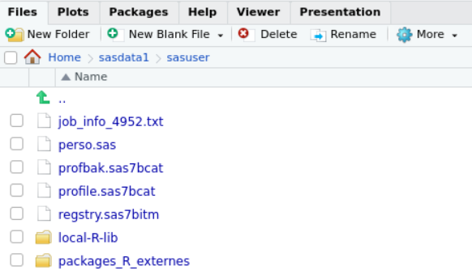
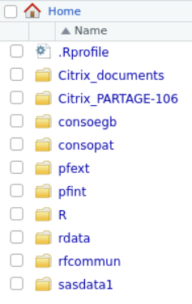
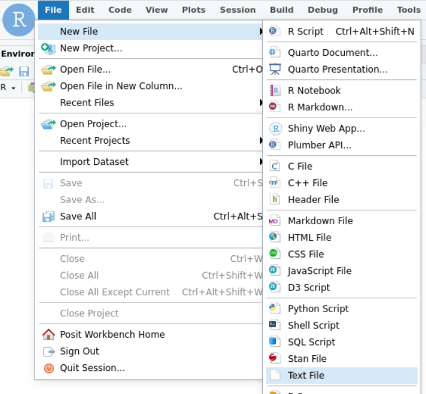
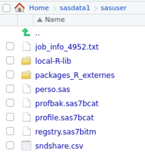
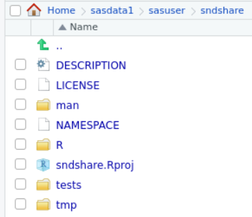
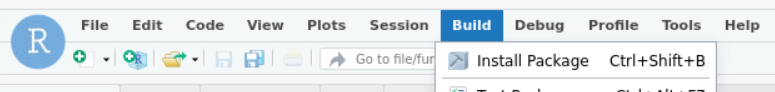

# sndshare

+ Package R à installer sur le serveur RStudio du SNDS.
+ Permet de partager simplement des projets SNDS menés sous RStudio.
+ Permet également de partager des packages R créés sur la plateforme.

# Comment ça marche ?

## Export d'un projet
+ Un projet/répertoire est compressé au format ZIP, puis encodé en [base64](https://fr.wikipedia.org/wiki/Base64) dans un fichier CSV à une seule colonne large de 76 caractères.
+ Ce fichier est ensuite placé dans votre répertoire download sur la plateforme
+ Si votre export concerne un package il est préférable que sa commande de BUILD l'installe dans le répertoire `~/sasdata1/sasuser/local-R-lib`

## Import d'un projet
+ Pour un projet normal, il suffit de copier/coller, dans un fichier format texte, le contenu du fichier CSV exporté avec la méthode ci-dessus.
+ Pour un projet volumineux, on peut importer le CSV vers la librairie ORAUSER depuis SAS pour en faire une table ORACLE.
+ Enfin on appelle la fonction d'import du package.

## Deux outils linux bash pour faciliter la manipulation des fichiers encodés en base64
+ Dans le répertoire linux_utils de ce dépot
### `extract_files_from_csv`
+ Décode et décompresse immédiatement le fichier `.csv`
### `update_csv_from_local`
+ Si vous modifiez votre projet sur votre machine locale, cette commande met à jour le fichier encodé `.csv` pour tenir compte de ces modifications.
# Installation rapide

+ Exécutez le code suivant sur la console :
+ /!\ Attention ce code modifie votre fichier `.Rprofile`
+ Si vous n'avez jamais modifé ce fichier tout devrait bien se passer, sinon lisez l'installation détaillée plus bas. 
```
fs::dir_create(paste0("~/sasdata1/sasuser/", c("packages_R_externes/", "local-R-lib/")))
system("echo '.libPaths(c(\"~/sasdata1/sasuser/local-R-lib/\", .libPaths()))' >> ~/.Rprofile")
```
+ Créez un fichier **de type Text** puis copiez/collez dedans le contenu du fichier `zzz_sndshare.csv` ci-dessus.
+ Sauvegardez ce fichier dans le répertoire `Home/sasdata1/sasuser/packages_R_externes` avec le nom suivant `sndshare.csv`

+ Exécutez le code suivant sur la console :
```
system("base64 -d ~/sasdata1/sasuser/packages_R_externes/sndshare.csv > sndshare.zip")
system("unzip -o sndshare.zip -d ~/sasdata1/sasuser/packages_R_externes/")
system("rm sndshare.zip ~/sasdata1/sasuser/packages_R_externes/sndshare.csv")
rstudioapi::openProject("~/sasdata1/sasuser/packages_R_externes/sndshare/sndshare.Rproj")
```

+ Cliquez sur `Install Package` dans le menu `Build`


# Installation détaillée

## Paramètrage de R et RStudio

### Création des répertoires nécessaires
+ Un répertoire pour le code source de ce package et de vos futurs packages :
```
Home/sasdata1/sasuser/packages_R_externes/
```
+ Un répertoire pour la version compilée des packages :
```
`Home/sasdata1/sasuser/local-R-lib/`
```
    
+ Vous pouvez executer les lignes suivantes sur la console pour la création des répertoires :
```
fs::dir_create(paste0("~/sasdata1/sasuser/", c("packages_R_externes/", "local-R-lib/")))
```
+ Vous devriez pouvoir obtenier le résultat suivant :

    <p align="center">
      
    </p>


### Désigner le répertoire `local-R-lib` comme un répertoire de librairies
+ Il faut créer un fichier texte `.Rprofile` dans votre répertoire `home` avec le contenu suivant :
+ Ou bien ajouter cette ligne si vous avez déjà un fichier `.Rprofile`
+ Ou juste ajouter le répertoire `~/sasdata1/sasuser/local-R-lib/`, si vous avez déjà modifié `.libPaths`

```
.libPaths(c("~/sasdata1/sasuser/local-R-lib/", .libPaths()) 
```

+ La commande suivante exécutée sur la console crée le fichier avec le bon contenu :
```
system("echo '.libPaths(c(\"~/sasdata1/sasuser/local-R-lib/\", .libPaths()))' > ~/.Rprofile")
```

+ Vous devriez pouvoir obtenier le résultat suivant :

    <p align="center">
      
    </p>

+ Vous pouvez alors vérifier le contenu de `.Rprofile`

### Copier le contenu du package `sdnshare` vers le serveur RStudio

+ Il faut copier/coller le contenu du fichier `zzz_sndshare.csv` de ce dépot git.
+ Il faut d'abord créer un nouveau fichier `.txt` côté RStudio (le type du fichier est TRÈS IMPORTANT):
    <p align="center">
      
    </p>
+ Il faut copier/coller le contenu du fichier `zzz_sndshare.csv` le fichier RStudio ouvert
+ NB : vous trouverez le fichier `zzz_sndshare.csv` dans la liste des fichiers de ce dépot tout en haut de cette page)

+ Une fois copié/collé le contenu, sauvegardez le fichier dans le répertoire `home/sasdata1/sasuser` en le nommant `sndshare.csv`.
+ Vous devriez obtenir le résultat suivant :
    <p align="center">
      
    </p>

### Production du répertoire du code source du package à partir du fichier `.csv`
+ Il faut utiliser `base64` et `unzip` comme ceci :
```
system("base64 -d ~/sasdata1/sasuser/packages_R_externes/sndshare.csv > sndshare.zip")
system("unzip -o sndshare.zip -d ~/sasdata1/sasuser/packages_R_externes/")
system("rm sndshare.zip ~/sasdata1/sasuser/packages_R_externes/sndshare.csv")
```
+ Vous devriez pouvoir obtenir le résultat suivant :
    <p align="center">
      
    </p>

+ Cliquez sur le fichier `sndshare.Rproj` pour ouvrir le projet du package.

### Construction du package sur le serveur

+ Bravo vous avez réussi à copier votre premier package sur la plateforme.
+ Le package `sndshare` que vous êtes en train d'installer va automatiser tout ce processus.
+ Il ne vous reste plus qu'à l'installer en cliquant sur le menu `Build` puis `Install Package` :

    <p align="center">
      
    </p>


+ Voilà c'est terminé !

### Vérification

+ Tapez `library(sndshare)` dans la console, si vous n'obtenez pas de message d'erreur c'est que l'installation est réussie.
